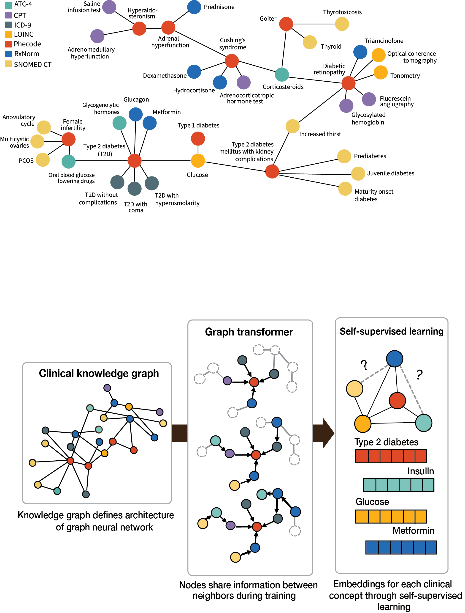
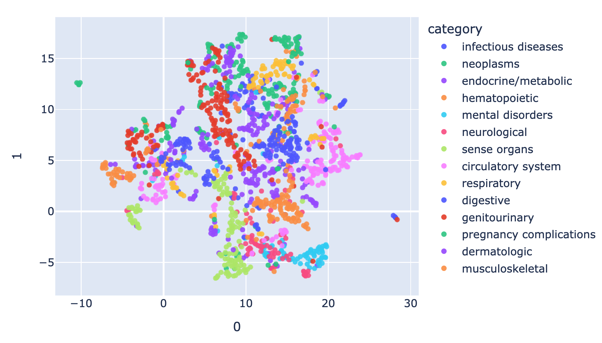

# ClinGraph & ClinVec: Unified Clinical Vocabulary Embeddings for Advancing Precision Medicine

### [NEW] Updated ClinGraph knowledge graph and ClinVec embeddings with 3-times the number of nodes! 
Download on Harvard Dataverse: [https://doi.org/10.7910/DVN/Z6H1A8](https://doi.org/10.7910/DVN/Z6H1A8) [no login required]

### [NEW] Step-by-step guide on downloading ClinGraph and ClinVec in DGL, NetworkX, PyTorch Genometric, and triplet format! 
See the notebook titled in `download_clingraph_clinvec.ipynb`.

## Overview

We introduce ClinGraph, a clinical knowledge graph that integrates 8 EHR-based vocabularies, and ClinVec, a set of 153,166 clinical code embeddings derived from ClinGraph using a graph transformer neural network. ClinVec provides a machine-readable representation of clinical knowledge that captures semantic relationships among diagnoses, medications, laboratory tests, and procedures. This resource offers a hypothesis-free approach to generating rich representations of clinical knowledge across standardized medical vocabularies without any dependence on patient-level information. 

The preprint can be found here: [https://www.medrxiv.org/content/10.1101/2024.12.03.24318322v2](https://www.medrxiv.org/content/10.1101/2024.12.03.24318322v2) 



## Installation and setup

Depending on what level of analysis you're performing, you may not need to install the full list of packages.

### "I just want the KG and/or embeddings"
No need to install any dependencies. Please download the ClinGraph node/edge files and ClinVec embeddings from Harvard Dataverse [here](https://dataverse.harvard.edu/dataset.xhtml?persistentId=doi:10.7910/DVN/Z6H1A8). The provided readme describes the available data formats and how to read in each object. 

### "I just want the scripts to construct the KG from the source files"

This only requires the following standard libraries. For this step, the exact version is not typically a strict requirement. Note that we have removed the requirement of CUDA-specific python packages for this step. 

```
networkx==3.3
pandas==2.2.2
numpy==1.24.4
```

Navigate to `kg/` where `build_clingraph.ipynb` will walk through downloading all of the source files and constructing the knowledge graph from scratch. Note that due to licensing, users will be required to register and download certain source files (e.g. UMLS, LOINC codes). 

### "I want to train and create embeddings from scratch"

This requires installing ML graph-specific libraries. We've provided the conda environment below. Note that the version requirement for DGL (Deep Graph Library) is very specific (v1.1)

Follow the previous step above to construct the KG or download the KG csv from Harvard Dataverse [here](https://dataverse.harvard.edu/dataset.xhtml?persistentId=doi:10.7910/DVN/Z6H1A8). The model source code and scripts for training are provided in `model/`.

### "I want to recreate the entire paper because I liked it so much"

Thank you for the flattery. We've provided individual Jupyter notebooks for each of the main analyses presented in the paper under `analyses/`. You will need to download the embeddings and associated key file (mapping indices to node names) here and change the file location at the top of each notebook.

<h2 id="tutorial">Tutorial </h2>

We've provided a short tutorial that walks through downloading the embeddings, mapping the embeddings to the corresponding clinical code names/ids, and some visualizations. See the notebook located in `tutorial/`. 



<h2>Questions </h2>

For questions, please leave a GitHub issue or contact Ruth Johnson at ruth_johnson @ hms.harvard.edu

<h2>License </h2>
The ClinGraph knowledge graph, ClinVec embeddings, and all associated code is licensed under the MIT License. 

<h2>Citation </h2>
If you use ClinGraph or ClinVec in your work, please add the following citation:

```
@article{johnson2024unified,
  title={Unified Clinical Vocabulary Embeddings for Advancing Precision},
  author={Johnson, Ruth and Gottlieb, Uri and Shaham, Galit and Eisen, Lihi and Waxman, Jacob and Devons-Sberro, Stav and Ginder, Curtis R and Hong, Peter and Sayeed, Raheel and Reis, Ben Y and others},
  journal={medRxiv},
  pages={2024--12},
  year={2024},
  publisher={Cold Spring Harbor Laboratory Press}
}
```

