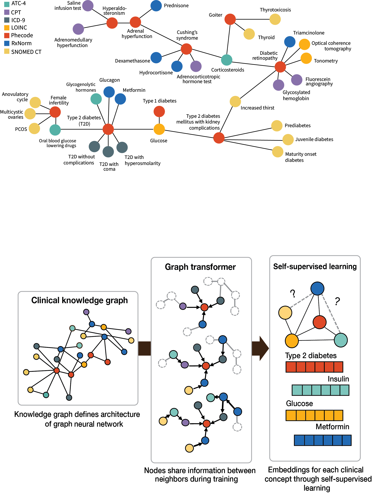

# Embeddings of clinical codes enable knowledge-grounded AI in medicine

#### [NEW] An early access version of the manuscript can be found here:  
[https://www.nature.com/articles/s41746-026-02664-9](https://www.nature.com/articles/s41746-026-02664-9)

#### [NEW] Updated project website:  
[https://zitniklab.hms.harvard.edu/projects/ClinVec/](https://zitniklab.hms.harvard.edu/projects/ClinVec/)

## Overview

We introduce ClinGraph, a clinical knowledge graph that integrates 8 EHR-based vocabularies, and ClinVec, a set of 153,166 clinical code embeddings derived from ClinGraph using a graph transformer neural network. ClinVec provides a machine-readable representation of clinical knowledge that captures semantic relationships among diagnoses, medications, laboratory tests, and procedures. This resource offers a hypothesis-free approach to generating rich representations of clinical knowledge across standardized medical vocabularies without any dependence on patient-level information. 

An early access version of the manuscript can be found here:  [https://www.nature.com/articles/s41746-026-02664-9](https://www.nature.com/articles/s41746-026-02664-9)

The full preprint can be found here: [https://www.medrxiv.org/content/10.1101/2024.12.03.24318322v2](https://www.medrxiv.org/content/10.1101/2024.12.03.24318322v2) 

Project website: [https://zitniklab.hms.harvard.edu/projects/ClinVec/](https://zitniklab.hms.harvard.edu/projects/ClinVec/)

<p align="center">
  
</p>

## Downloading ClinGraph & ClinVec
#### 1. Downloading ClinGraph
Please download the ClinGraph node/edge files and ClinVec embeddings from Harvard Dataverse ([https://dataverse.harvard.edu/dataset.xhtml?persistentId=doi:10.7910/DVN/Z6H1A8](https://dataverse.harvard.edu/dataset.xhtml?persistentId=doi:10.7910/DVN/Z6H1A8)). Note that there is NO LOGIN required. A more in-depth tutorial for downloading the files is in `tutorials/010_download_clingraph_clinvec.ipynb`.

#### 2. ClinGraph formats
You can click the format you'd like to download (described below). Click on the **Download button** and select "Original Format". Alternatively, click **Access Dataset** at the top right-hand corner to download everything in a zip. 
- `ClinGraph_node.csv`: this contains all the node metadata and index information.
- `ClinGraph_edges.csv`: this contains the triplet information used to construct the KG. We also include each node's metadata that's found in ClinGraph_node.csv for convenience.
- `ClinGraph_dgl.bin`: ClinGraph in DGL binary format. We store the node types and node features under the node data (`ndata`) attribute. 
- `ClinGraph_adjlist.csv`: ClinGraph in adjacency list format; format matches NetworkX syntax. This format does not include node features.
- `ClinGraph_pyg.pt`: ClinGraph as a PyTorch Genometric object. Node features are saved under the `x` attribute.

#### 3. Read in ClinGraph using format of choice.

```
# DGL
from dgl.data.utils import load_graphs
graph_list, _ = load_graphs("ClinGraph_dgl.bin")
g = graph_list[0]

# NetworkX
import networkx as nx
g = nx.read_adjlist("ClinGraph_adjlist.csv")

# PyTorch Geometric
from torch_geometric.data import Data
import torch

g = torch.load('ClinGraph_pyg.pt', weights_only=False)
```
#### 4. Download ClinVec (embeddings).

The embeddings are located in the same repository as ClinGraph. We separate embedding files by source vocabulary. 

- `ClinVec_atc.csv` 
- `ClinVec_cpt.csv`
- `ClinVec_icd10cm.csv`
- `ClinVec_icd9cm.csv`
- `ClinVec_lnc.csv`
- `ClinVec_phecode.csv`
- `ClinVec_rxnorm.csv`
- `ClinVec_snomedct.csv`
- `ClinVec_umls.csv`

#### 5. Read in embeddings.

```
import pandas as pd

# load phecode embeddings
df = pd.read_csv("ClinVec_phecode.csv")

# get matrix of embeddings
emb_mat = df.values

# get node metadata
node_df = pd.read_csv("ClinGraph_nodes.csv", sep='\t')
df['node_index'] = df.index
phecode_emb_df = df.merge(node_df, how='inner', on='node_index')
```

## Reproducing analyses and main figures from the preprint

### Constructing ClinGraph from scratch
Navigate to `tutorial/` where `020_build_kg.ipynb` will walk through downloading all of the source files and constructing the knowledge graph from scratch. Note that due to licensing, users will be required to register and download certain source files (e.g. UMLS, LOINC codes). 

### Training ClinGraph using HGT
The key dependencies are PyTorch (v.2.5.1+cu124), pytorch-lightning (`v2.5.2`), and DGL (Deep Graph Library) (`v1.1`). Note that the version requirement for DGL (Deep Graph Library) will be v1.x.x (default installation is v2.x.x)

`pip install  -v "dgl==1.1" -f https://data.dgl.ai/wheels/torch-2.4/cu124/repo.html`

Follow the previous step above to construct the KG or download the KG csv from [Harvard Dataverse](https://dataverse.harvard.edu/dataset.xhtml?persistentId=doi:10.7910/DVN/Z6H1A8). The model source code and scripts for training are provided in `model/` and the main training script is `model/main.py`.

### Where are the scores for the clinician-annotated clinical terms?
The full list of scored clinical term pairs can be found here: `tutorials/clinician_pair_scores.csv`. A description of each column is below:

- `phenotype` - first clinical term in the form of a Phecode
- `category` - disease category of the phenotype
- `node_name` - second clinical term in the form of a SNOMED CT code
- `node_id` - ClinGraph node id for the node name
- `score` - clinician annotated score from 1 (least related) to 5 (most related)
  
### Replicating main analyses/figures
We've provided individual Jupyter notebooks for each of the main analyses presented in the paper under `tutorials/`. You will need to download the embeddings and associated key file (mapping indices to node names) here and change the file location at the top of each notebook.

```
010_download_clingraph_clinvec.ipynb
020_build_kg.ipynb
030_umap.ipynb
040_embedding_composition.ipynb
050_risk_score_weights.ipynb
060_medqa.ipynb
070_zero_shot_retreival.ipynb
080_clinician_benchmark.ipynb
```

<h2>Questions </h2>

For questions, please leave a GitHub issue or contact Ruth Johnson at ruth_johnson @ hms.harvard.edu

<h2>License </h2>
The ClinGraph knowledge graph, ClinVec embeddings, and all associated code is licensed under the MIT License. 

<h2>Citation </h2>
If you use ClinGraph or ClinVec in your work, please add the following citation:

```
@article{johnson2026embeddings,
  title={Embeddings of clinical codes enable knowledge-grounded AI in medicine},
  author={Johnson, Ruth and Gottlieb, Uri and Shaham, Galit and Eisen, Lihi and Waxman, Jacob and Devons-Sberro, Stav and Ginder, Curtis R and Hong, Peter and Sayeed, Raheel and Su, Xiaorui and others},
  journal={npj Digital Medicine},
  year={2026},
  publisher={Nature Publishing Group}
}
```

